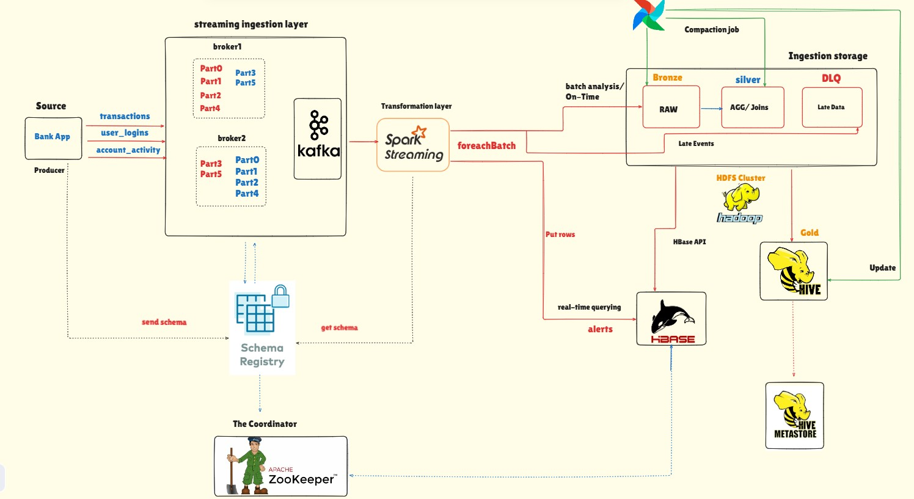

# 🏦 Banking Data Lake & Real-Time Streaming Pipeline

## 📖 Overview
    This project implements a robust, end-to-end Data Lake for a banking/financial institution using the Medallion Architecture (Bronze ➔ Silver). It is fully containerized using Docker and is designed to handle both real-time streaming ingestion and scheduled hourly batch processing.
    The pipeline ingests raw banking transactions, stores them in a highly available HDFS cluster, compacts the data for analytical querying, and automatically registers metadata in a Hive Metastore.
## 🛠️ Tech Stack
*  Message Broker: Apache Kafka (with Schema Registry)
*  Stream Processing: Apache Spark Structured Streaming
*  Batch Processing: Apache Spark (PySpark)
*  Storage Layer: Apache Hadoop (HDFS)
*  Orchestration: Apache Airflow 2.7
*  Metadata Management: Apache Hive Metastore (backed by PostgreSQL)
*  Infrastructure: Docker & Docker Compose
## 🏗️ Architecture & Data Flow

### our Arch
 

### 1. Ingestion (Real-Time)
- A Python producer generates mock banking transactions/account activity and pushes them to a Kafka topic (account_activity).
- A continuous Spark Structured Streaming job consumes these messages.
- Data is written to the Bronze Layer in HDFS as Parquet files, automatically partitioned by Date and Hour (dt=YYYY-MM-DD/hr=HH). Checkpointing is used to ensure - - -  exactly-once semantics and handle job restarts safely (failOnDataLoss=false).
### 2. Orchestration & Compaction (Batch)
Because streaming jobs create hundreds of tiny files (the "small file problem" in Hadoop), Apache Airflow runs an hourly DAG (banking_data_lake_maintenance) to optimize the storage:
- Sensor (sense_bronze_data): A WebHdfsSensor intelligently waits for the previous hour to finish writing data to HDFS.
- Compaction (compact_to_silver): A SparkSubmitOperator triggers compactor.py. It reads the hundreds of small Parquet files from the Bronze layer and merges them -  -   (coalesce(n)) into a single, high-performance file in the Silver Layer.
- Metadata Sync (repair_bronze_metadata): A BashOperator utilizes spark-sql to run MSCK REPAIR TABLE, keeping the Hive Metastore partitions in sync with the physical HDFS directories.

## 🚀 Project Structure

```
📦 BANKING-TRANSACTION-MONITORING
 ┣ 📂 infra                         # Infrastructure as Code
 ┃ ┣ 📂 configs                     # Container configurations
 ┃ ┣ 📂 hadoop / hbase / kafka / spark # Service-specific setups
 ┃ ┣ 📜 .env                        # Environment variables
 ┃ ┗ 📜 docker-compose.yml          # Main cluster deployment file
 ┣ 📂 ingestion                     # Data Generation & Schemas
 ┃ ┣ 📂 producre                    # Python scripts generating Kafka events
 ┃ ┗ 📂 schema                      # Avro schemas (account_activity, transaction, etc.)
 ┣ 📂 orchestration                 # Workflow Management
 ┃ ┗ 📂 airflow
 ┃   ┣ 📂 dags
 ┃   ┃ ┗ 📜 bank_rist_orchestration.py # The main DAG
 ┃   ┣ 📜 Dockerfile                # Custom Airflow image (Java & procps included)
 ┃   ┗ 📜 requirements.txt          # Airflow Python dependencies
 ┗ 📂 processing                    # Data Transformation (Spark)
   ┣ 📂 batch
   ┃ ┗ 📜 compactor.py              # PySpark job: Bronze -> Silver compaction
   ┗ 📂 spark-streaming
     ┣ 📜 config.py                 # Streaming configurations
     ┣ 📜 processor.py              # Main Structured Streaming entrypoint
     ┣ 📜 schema_registry_client.py # Avro deserialization logic
     ┣ 📜 sinks.py                  # HDFS write logic & checkpointing
     ┗ 📜 streams.py                # Kafka read logic
 ```

## ⚙️ Setup & Installation

###  Prerequisites
- Docker and Docker Compose
- Minimum 12GB - 16GB RAM allocated to Docker (WSL2 recommended for Windows)
- Running the Infrastructure
Clone the repository:
```
git clone https://github.com/yourusername/banking-data-lake.git
cd banking-data-lake
```
Build the Custom Airflow Image:
(Note: The custom image includes OpenJDK 17 and procps required for SparkSubmit tasks).
```
docker-compose build
```
Start the Cluster:
```
docker-compose up -d
```
- Verify Containers: Ensure namenode, datanode, broker, spark-master, spark-worker, hive-metastore, and airflow are running.
- Executing the Pipeline
- Start the Kafka Producer to begin generating real-time transactions.
- Submit the Spark Streaming Job to read from Kafka and write to HDFS:
```
docker exec -it spark-master spark-submit /opt/spark/processing/spark-streaming/processor.py
```
- Enable the Airflow DAG: Navigate to the Airflow UI (http://localhost:8080), locate banking_data_lake_maintenance, and toggle it on. It will automatically process the previous hour's data at the top of every hour.

## 🧠 Key Challenges Solved
### HDFS Safe Mode Handling: Implemented waits/force-leaves for NameNode initialization.
### Airflow Date Templating: Synchronized {{ data_interval_start }} variables across Sensors and Operators to prevent "midnight crossover" bugs where hours and dates desync.
### Spark on WSL Resource Exhaustion: Throttled Kafka ingestion using maxOffsetsPerTrigger and explicitly managed Spark Driver/Executor memory in Airflow to prevent Docker container freezes.

## P.S. How to fix that final Spark Master error you are getting right now:
- Since you reduced the memory and it still failed with All masters are unresponsive, the issue is Docker Networking. When Airflow runs spark-submit, Spark launches a driver inside the Airflow container, but the Spark Worker (in another container) doesn't know how to route network traffic back to Airflow.
- To fix this permanently:
-- Open your docker-compose.yml, find the airflow service (or airflow-worker), and add this environment variable so Spark knows how to find the driver:
```
Yaml
environment:
  - SPARK_LOCAL_IP=airflow
  - SPARK_DRIVER_HOST=airflow
```  
-- (Then run docker-compose down && docker-compose up -d). This will allow the Master to talk back to your Airflow task!